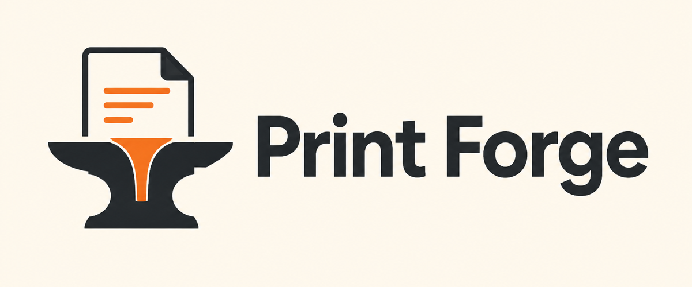

<p align="center">
  
</p>

# Print Forge

Print Forge is a Rust workspace for data-driven print and PDF generation.
The template and layout layers are deliberately independent from the PDF library
so additional renderers can be added without changing the project format.

## Workspace

```text
apps/cli          Command-line entry point
apps/studio       Native visual template builder
crates/template   Serializable template schema
crates/dataset    CSV and JSON dataset loading
crates/engine     Renderer-neutral resolved document and draw commands
crates/pdf        PDF renderer boundary and printpdf adapter home
crates/validation Semantic validation and preflight diagnostics
examples          Example templates and data
```

## Studio

Print Forge Studio is a native desktop template builder that reads and writes
the same versioned JSON used by the CLI. Launch it during development with:

```sh
cargo run -p print-forge-studio
```

The initial Studio supports native open/save dialogs, multipage projects,
draggable, resizable, and rotatable page elements, named layers with persisted
visibility and editing locks, drag-to-reorder paint order,
document and element inspectors with inline color pickers, variable-field
definitions, live semantic validation, raw JSON editing for advanced elements,
preview data, 100-step undo/redo history, and direct PDF rendering through the
Print Forge layout and PDF crates. Elements can be rotated with the canvas
handle, an exact inspector value, or the 90-degree shortcuts. The Layers panel
can hide, lock, rename, drag, or move the selection backward, forward, fully
behind, or fully in front. Hidden layers are omitted from both Studio previews
and exported PDFs; locked layers remain selectable but resist editing commands.
Non-printing rulers and page-specific guides support center lines, a quick 18pt
margin set, exact point positions, and
creation by dragging from the top or left ruler. Existing guides can be dragged
directly on the canvas. Smart snapping aligns moves, resizes, and line endpoints
to page edges and centers, guides, and neighboring layer edges and centers;
magenta feedback lines show the active alignment, and holding Option/Alt
temporarily bypasses snapping. `Cmd/Ctrl+;` toggles guides and
`Cmd/Ctrl+Shift+;` toggles snapping. Both the design canvas and its read-only
rendered-preview mode use resolved engine output, so preview data, wrapped text,
flow pagination, composed elements, raster images, SVG artwork, QR codes, and
Code 128 bars are represented on screen. Generated continuation pages can be
navigated directly in rendered-preview mode, and bleed and trim boundaries are
shown separately. Missing preview values remain visible as `{{field}}`
placeholders and are reported in the canvas toolbar instead of preventing the
preview from rendering. Screen font rasterization is still an approximation;
the rendered PDF remains authoritative for final typography and print
inspection.

`Cmd/Ctrl+Z` undoes an edit and `Cmd/Ctrl+Shift+Z` redoes it. Canvas gestures
and inspector typing sessions are coalesced into single history steps.
Shift-click selects multiple layers from the canvas or Layers panel. The
multi-selection inspector aligns visible edges and centers, distributes equal
horizontal or vertical gaps, and performs bulk duplicate or delete operations.
Dragging or using the arrow keys moves the selection together; Shift+Arrow
nudges by 10pt, `Cmd/Ctrl+A` selects every layer, and Escape clears selection.

Imported tables, groups, stacks, and repeaters remain editable through the JSON
view while their dedicated visual inspectors are developed.

## CLI

During development, run the CLI through Cargo as `cargo run -- <COMMAND>`.
After installing the binary, use the equivalent `print-forge <COMMAND>` form.
Every command supports `--help`; the root command also supports `--version`.

### Global options

| Option | Default | Description |
| --- | --- | --- |
| `--json` | Off | Emit one machine-readable JSON document on stdout. |
| `-v`, `--verbose` | Off | Include operational details and structured exit information; repeat for more detail. |
| `--warnings <POLICY>` | `allow` | Use `allow`, `deny`, or `ignore` to control validation warnings. |

### Commands

| Command | Usage | Purpose |
| --- | --- | --- |
| `validate` | `validate <TEMPLATE> [--dataset <DATASET>]` | Validate a JSON template and, optionally, every CSV or JSON dataset row. |
| `inspect-data` | `inspect-data <DATASET>` | Parse a CSV or JSON dataset and report its row count. |
| `render` | `render <TEMPLATE> <DATASET> <OUTPUT> [OPTIONS]` | Render one combined PDF or one PDF per selected dataset row. |

For `render`, `<OUTPUT>` is a PDF path in combined mode and a directory in
separate mode.

### Render options

| Option | Default | Description |
| --- | --- | --- |
| `--output-mode <MODE>` | `combined` | Choose `combined` for one multipage PDF or `separate` for one PDF per row. |
| `--rows <START-END>` | All rows | Select a one-based, inclusive row range. |
| `--limit <COUNT>` | No limit | Limit the number of rows after applying `--rows`. |
| `--continue-on-error` | Off | Continue after row failures; the command still exits unsuccessfully if any row fails. |
| `--output-name <PATTERN>` | `row-{{row}}` | Set filenames in separate mode using fields, dotted paths, and the one-based `{{row}}` value. |
| `--summary <PATH>` | None | Write a JSON job summary with results, warnings, output paths, and elapsed time. |
| `--print-ready` | Off | Enable PDF/X-4, 300 DPI image preflight, and mandatory embedded fonts. |
| `--min-image-dpi <DPI>` | None | Reject images below the specified effective output resolution. |
| `--require-embedded-fonts` | Off | Embed bundled Helvetica variants and require every text font to be embedded. |
| `--pdf-x <x4>` | None | Generate and validate against the selected PDF/X target. |
| `--dry-run` | Off | Validate, lay out, render, and preflight selected rows without writing files. |

Separate-mode names are made filesystem-safe. Existing or duplicate names get
a numeric suffix instead of being overwritten. `--print-ready` is the complete
prepress preset; `--pdf-x`, `--min-image-dpi`, and
`--require-embedded-fonts` can also be selected independently.

### Examples

```sh
# Discover the complete API.
cargo run -- --help
cargo run -- render --help

# Validate inputs or inspect a dataset.
cargo run -- validate examples/business-card.json --dataset examples/people.csv
cargo run -- inspect-data examples/people.csv

# Get automation-safe output or reject every warning.
cargo run -- --json validate examples/business-card.json --dataset examples/people.csv
cargo run -- --warnings deny validate examples/business-card.json

# Render every row into one combined PDF.
cargo run -- render examples/business-card.json examples/people.csv \
  output/pdf/business-cards.pdf \
  --summary output/jobs/business-cards.json

# Exercise the complete job without creating PDFs or summaries.
cargo run -- --json render examples/business-card.json examples/people.csv \
  output/pdf/business-cards.pdf --dry-run

# Render selected rows into separate, safely named PDFs.
cargo run -- render examples/business-card.json examples/people.csv \
  output/pdf/business-cards \
  --output-mode separate \
  --output-name '{{last_name}}-{{first_name}}' \
  --rows 1-2 \
  --continue-on-error

# Apply the complete print-ready preset.
cargo run -- render examples/business-card.json examples/people.csv \
  output/pdf/business-cards-print-ready.pdf \
  --print-ready

# Render the flow-layout and pagination fixture.
cargo run -- render examples/flow-layout.json examples/flow-layout-data.json \
  output/pdf/flow-layout.pdf

# Render the paginated invoice-table fixture.
cargo run -- render examples/table-invoice.json examples/table-invoice-data.json \
  output/pdf/table-invoice.pdf

# Render a print-ready three-column flight checklist.
# Its six checklist sections and multiline notes are populated from the data JSON.
cargo run -- render examples/flight-checklist.json \
  examples/flight-checklist-data.json \
  output/pdf/flight-checklist.pdf \
  --print-ready

# Render vector SVG, QR, and Code 128 specialty elements.
cargo run -- render examples/specialty-elements.json \
  examples/specialty-elements-data.json \
  output/pdf/specialty-elements.pdf

# Render reusable groups as a repeated label grid.
cargo run -- render examples/label-sheet.json examples/label-sheet-data.json \
  output/pdf/label-sheet.pdf

# Render a nested product array as a paginated catalog.
cargo run -- render examples/product-catalog.json examples/product-catalog-data.json \
  output/pdf/product-catalog.pdf
```

The flight checklist reads its palette from the nested `theme` object in the data JSON. The
default dataset uses **Spruce Ledger**; ready-to-render **Harbor Blue**, **Cider Note**, and
**Mulberry Ink** presets are available in `examples/flight-checklist-data-{harbor,cider,mulberry}.json`.
Copy a preset's `theme` object into your checklist data to change its appearance without editing
the template.

## Output and template behavior

### Position, rotation, and paint order

Page, header, footer, group, stack, and repeater element arrays paint in their
declared order: later visual elements appear in front of earlier ones. Studio's
layer list shows the frontmost element at the top and changes this canonical
array order when an element is dragged or moved backward or forward, so Studio,
library, and CLI output remain consistent. Every non-page-break element also
accepts optional `name`, `visible`, and `locked` layer metadata. `visible`
defaults to `true` and controls engine/PDF output; `locked` defaults to `false`
and is an editor hint that Studio enforces without changing rendered output.

Text, image, rectangle, SVG, QR code, and barcode elements accept an optional
`rotation` number in clockwise degrees. Rotation uses the center of the
element's bounds as its pivot. Lines retain endpoint-based direction, while
groups, stacks, tables, repeaters, and page breaks currently do not accept
rotation.

### Print-ready PDFs

The print-ready preset produces PDF/X-4 with a FOGRA39 output intent, 300 DPI
image preflight, mandatory embedded fonts, document metadata, and explicit
media, bleed, crop, and trim boxes. PDF/X output is validated after
serialization and rejected if its version, XMP declaration, output intent, ICC
profile, page boxes, or embedded fonts are incomplete.

Built-in Helvetica regular, bold, oblique, and bold-oblique faces are replaced
with their bundled embeddable equivalents when embedded fonts are required.
Other built-in families must be declared under `fonts` with external font files
so print-ready output never silently substitutes an unrelated typeface.

Colors use one of three strict forms: `#RRGGBB`, `rgb(R, G, B)` with integer
components from 0 to 255, or `cmyk(C%, M%, Y%, K%)` with percentages from 0 to
100. Template metadata is configured under `document.metadata`; supported
fields are `title`, `author`, `subject`, `keywords`, and `identifier`. When no
identifier is supplied, Print Forge derives a stable one from the resolved
document. Identical inputs produce byte-identical PDFs.

### Flow layout and pagination

A positioned `stack` defines a flow region that can coexist with absolute
elements on the same template page. Vertical stacks place children from top to
bottom and create continuation pages by default; horizontal stacks place one
row from left to right. Both support uniform `padding` and inter-item `gap`.

Within a flow stack, child `position.width` and `position.height` are size
hints; `position.x` and `position.y` are ignored. Vertical text may omit its
position and is measured from its resolved, wrapped content. Images,
rectangles, SVGs, and horizontal text require size hints. Coordinate-based
lines remain absolute elements.

`overflow: "paginate"` is the default. `overflow: "error"` rejects content
that needs an automatic continuation page. A `page_break` starts a continuation
explicitly in a vertical stack or between top-level page elements.
`keep_together: true` requires the entire stack to fit one page and cannot be
combined with an explicit break. `orphans` defaults to 1 and sets the minimum
number of flow items that must precede an automatic break.

Each page may declare absolute-positioned `header` and `footer` arrays. Their
commands are reused on every continuation page generated from that template
page. Flow items are currently atomic across page boundaries; text and images
are moved as units rather than split internally.

### MVP tables

A positioned top-level `table` reads an array of objects from its `source`.
Columns use either a physical fixed width or a percentage of the table region;
all resolved column widths must exactly fill that region. Cell text wraps and
determines row height before pagination. Rows remain atomic, continuation pages
repeat the table header, and the template page's reusable header and footer are
also preserved.

Tables support uniform cell padding, grid borders, header/body/alternating row
backgrounds, and per-column text alignment. Column formats include grouped
numbers, symbol-prefixed currency, and validated ISO `YYYY-MM-DD` dates rendered
as ISO, US, European, or long dates.

The MVP deliberately accepts scalar cell values only. Table rows must be
objects; merged cells, nested tables, arbitrary cell children, and custom cell
layouts are rejected rather than silently simplified.

### Specialty elements

A positioned `svg` reads a local SVG asset relative to the template file and
embeds it as vector PDF content. Its `fit` option uses the same `contain`,
`cover`, and `stretch` behavior as raster images; `contain` is the default.

A `qr_code` resolves its `value` from job data and supports `low`, `medium`,
`quartile`, and `high` error correction. Its quiet zone defaults to the
required four modules and may be increased. QR bounds must be square. A
`barcode` currently supports `format: "code128"`; its quiet zones default to
ten narrow modules on both sides. Both elements accept strict `color` and
`background` print colors and remain vector shapes in the PDF.

Scan preflight rejects QR and Code 128 modules narrower than 0.5pt, QR quiet
zones below four modules, Code 128 quiet zones below ten modules, non-square QR
bounds, and Code 128 bars shorter than 14.4pt. Payload-dependent module width
is checked after template variables resolve, so long values cannot silently
produce an unreadably dense symbol.

### Reusable composition and repetition

A positioned `group` is a reusable local coordinate system. Child coordinates
are relative to the group's lower-left origin, so moving the group translates
all of its text, images, rectangles, lines, nested groups, and non-paginating
stacks together. A group used as a flow child requires position width and
height as its size hint.

A top-level `repeater` resolves its dotted `source` path to a JSON array and
copies one positioned template for each item. The template's position defines
the first slot and its width and height define the repeating step. `vertical`
fills downward, `horizontal` fills to the right, and `grid` fills rows from
left to right before moving downward. When no more complete slots fit on the
page, Print Forge creates a continuation page and repeats that template page's
header and footer.

Object fields in the current item are available directly, such as `{{name}}`.
The same value is always available under `{{item.name}}`, `{{index}}` is the
one-based item number, and original job data remains available under paths such
as `{{root.customer.name}}`. Scalar array items are available as `{{item}}`.
Repeaters currently remain top-level elements, and repeated templates cannot
contain tables, page breaks, or nested repeaters.

The current renderer supports measured and wrapped text, embedded font
families, local PNG/JPEG images, rectangles, lines, stacks, tables, and
pagination, translated groups, vertical/horizontal/grid repeaters, vector SVG,
QR codes, and Code 128 barcodes. Asset paths are resolved relative to the
template file.

### Automation and exit codes

`--json` reserves stdout for exactly one JSON document and suppresses text
progress and diagnostics. Successful renders return the job summary. Failures
return an object containing `status`, `exit_code`, and `error`.

| Exit code | Meaning |
| --- | --- |
| `0` | Command completed successfully. |
| `2` | CLI syntax or option parsing failed. |
| `3` | A validation or inspection input could not be loaded, parsed, or validated. |
| `4` | A render job, including its inputs, preflight, or output operation failed. |

CSV and top-level JSON-array datasets are streamed during render jobs rather
than retained as one in-memory dataset. Combined output still retains resolved
pages until the final multipage PDF is assembled; separate mode keeps only the
current row's document.

## Library API

The renderer-neutral `LayoutEngine` trait accepts `LayoutOptions`, and the
`DocumentRenderer` trait returns the stable `PdfResult`/`PdfError` boundary.
`PdfError` distinguishes preflight, rendering, and conformance failures. The
dataset crate exposes `DatasetError`, `DatasetFormat`, `visit_path`,
`visit_csv_reader`, and `visit_json_reader` for typed failures and bounded-memory
row processing. Public error enums are non-exhaustive so new variants can be
added compatibly.

## Development

The workspace requires Rust 1.88 or newer.

```sh
cargo fmt --all -- --check
cargo clippy --workspace --all-targets -- -D warnings
cargo test --workspace
cargo bench --workspace --no-run
```

Benchmarks exercise 50,000-row CSV/JSON streams, 1,000-row table layout, and
24-page image-heavy PDF rendering. CI runs formatting, Clippy, the full test
suite, benchmark compilation, and representative PDF renders.

## Project status and roadmap

Print Forge now has an end-to-end MVP: versioned JSON templates, CSV and JSON
data, absolute and flow layout, pagination, tables, reusable groups and
repeaters, SVG/QR/Code 128 elements, combined or per-record PDF jobs, print
preflight, automation-safe CLI output, typed library boundaries, benchmarks,
and CI. The earlier implementation checklist is intentionally not repeated
here; Git history records that work better than a wall of completed boxes.

The roadmap below contains only unfinished work. Priorities favor a dependable
`0.1` release before expanding the template language.

### P0 — Ship a usable 0.1 release

- [ ] Make Print Forge Studio a supported no-code authoring path: add visual
      inspectors for every MVP element, asset/font management, representative data-row
      selection, and an exact PDF-rasterized typography preview; then include
      the desktop app in release packaging.
- [ ] Generate and publish a versioned JSON Schema plus a human-readable
      template reference covering every field, element, default, constraint,
      and unsupported combination, with a valid example for each element type.
- [ ] Document the coordinate system, physical units, bleed and page boxes,
      asset-path resolution, font selection, color handling, and pagination
      rules in focused guides rather than only feature summaries.
- [ ] Turn the existing fixtures into task-oriented recipes for business cards,
      labels, invoices, product catalogs, and print-ready output, including the
      expected command and result for each recipe.
- [ ] Add release automation for versioned macOS, Linux, and Windows binaries,
      checksums, release notes, and installation/upgrade instructions.
- [ ] Define the compatibility contract for `schema_version`, CLI JSON output,
      public Rust APIs, deprecations, and migrations before publishing them.
- [ ] Add automated raster snapshots for representative PDFs so CI verifies
      visual output, not only successful generation and PDF structure.
- [ ] Cross-check representative PDF/X output with an independent preflight
      tool or print workflow and document the supported profile assumptions and
      known interoperability limits.

The `0.1` release is ready when a new user can install a binary, choose a
documented example, validate it, render it, and compare the result without
reading the Rust source.

### P1 — Reliability and scale

- [ ] Make PDF and summary writes atomic, and define cleanup behavior for
      interrupted or partially successful per-record jobs.
- [ ] Extend bounded-memory dataset processing to `validate` and
      `inspect-data`; avoid the render command's current counting pass where a
      single-pass job is possible.
- [ ] Spool or incrementally assemble combined jobs so document size is not
      limited by retaining every resolved page in memory.
- [ ] Version the JSON result envelope and return diagnostics as structured
      code/severity/path/message objects instead of flattening failures into one
      error string.
- [ ] Add configurable safety limits for rows, generated pages, asset sizes,
      output bytes, and deeply nested input before accepting untrusted jobs.
- [ ] Add fuzz and property tests for template parsing, variable resolution,
      pagination, output-name sanitization, and malformed PDF preflight input.
- [ ] Record benchmark baselines and fail CI on deliberate, stable regression
      thresholds rather than compiling benchmarks without evaluating results.

### P2 — Template-language depth

These are post-MVP candidates. Their order should be driven by real document
requests after `0.1`, not by implementing every desktop-publishing feature.

- [ ] Add conditional visibility and explicit fallback/default values without
      turning template expressions into an unrestricted scripting language.
- [ ] Add named component definitions and local includes so repeated designs
      can be reused across pages and templates without JSON duplication.
- [ ] Improve international typography with shaping, font fallback, and clear
      right-to-left and complex-script behavior.
- [ ] Allow long flow text to split across pages while preserving widow/orphan
      and keep-together guarantees.
- [ ] Add practical table extensions such as footer rows, row groups,
      subtotals, and per-column locale-aware formatting; keep nested tables and
      arbitrary cell layout out of scope until there is a concrete use case.
- [ ] Expand prepress controls with user-supplied ICC profiles, selectable
      output intents, crop/registration marks, and spot-color support.
- [ ] Add high-demand barcode formats such as EAN-13, UPC-A, and Data Matrix,
      each with format-specific validation and scan-size preflight.

### Roadmap rules

- Every feature ships with semantic validation, CLI and library tests, a
  documented example, and a representative render fixture.
- Correctness and actionable failures take precedence over silently accepting
  unsupported layout behavior.
- New schema features must state their pagination, composition, data-scope, and
  compatibility behavior before implementation.
- GUI authoring, remote asset fetching, arbitrary HTML/CSS rendering, and a
  general-purpose expression language are not current roadmap commitments.
